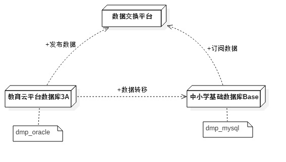

### DMP项目说明

整体流程说明

 

#### 1. 代码说明

##### 1.1. 分页查询和数据库切换自定义

最新：由于动态数据库的事务控制不好处理，改为单数据源进行处理。

mybatis的拦截器实现分页，数据库默认mysql，动态切换使用dbType不同的dataSource切换。

```java
		UserVo userVo = new UserVo();
		userVo.setPage(new Page<UserVo>(2,10));//设置分页
		userVo.setDbType(BaseEntity.DB_ORACLE);//设置首选数据库
		List<UserVo> list = userMapper.selectList(userVo);//使用分页查询
```

##### 1.2. 定时任务的数据库配置

通过实体类QuartzJobVo，定义jobName, jobGroup, cronExpression ,targetObject,targetMethod 配置到数据库表中。

spring实例化bean时，加载表数据，然后通过springcontext获取配置的bean和method，反射方式执行方法。这样可以实现定时任务的数据库。后续需要加入是否并行执行，集群环境的逻辑处理。

数据库表：config_quartz_job

```java
	private String jobName; //任务名称
	private String jobGroup; //任务组
	private String jobStatus; //任务状态
	private String cronExpression; //任务时间
	private String targetObject; //目标对象
	private String targetMethod; //目标方法
	private String beanClass; //对象class
	private String description;//描述
	private String concurrent;//是否并行运行
```

##### 1.3. 通过xml模板快速创建mapper.xml

Eclipse-->Preferences-->XML-->XML Files-->Templates 编写 New XML

```xml
<?xml version="1.0" encoding="UTF-8"?>
<!DOCTYPE mapper PUBLIC "-//mybatis.org//DTD Mapper 3.0//EN" "http://mybatis.org/dtd/mybatis-3-mapper.dtd">
<mapper namespace="com.whty.**">

    <sql id="resultColumn">
        id,
        status,
        create_by as createBy,
        create_time as createTime,
        update_by as updateBy,
        update_time as updateTime,
        del_flag as delFlag
    </sql>
    
    <!-- 查询单个 -->
    <select id="selectOne" parameterType="tableVo" resultType="tableVo">
        select <include refid="resultColumn" />
        from table_name
        <trim prefix="WHERE" prefixOverrides="AND |OR ">
            <if test="id != null">
                id = #{id}
            </if>
            <if test="status != null and status !=''">
                AND status = #{status}
            </if>
            <if test="delFlag != null and delFlag !=''">
                AND del_flag = #{delFlag}
            </if>
        </trim>
    </select>
    
    <!-- 查询列表 -->
    <select id="selectList" parameterType="tableVo" resultType="tableVo">
        select <include refid="resultColumn" />
        from table_name
        <trim prefix="WHERE" prefixOverrides="AND |OR ">
            <if test="id != null">
                id = #{id}
            </if>
            <if test="delFlag != null and delFlag !=''">
                AND del_flag = #{delFlag}
            </if>
        </trim>
    </select>
    
    <!-- 根据主键删除 -->
    <delete id="delete" parameterType="tableVo">
        delete from table_name
              where  id = #{id}
    </delete>
    
    <!-- 插入 -->
    <insert id="insert" parameterType="tableVo">
        insert into table_name(
            id,
            create_by,
            create_time,
            update_by,
            update_time,
            del_flag
        ) values (
            #{id},
            #{createBy},
            #{createTime},
            #{updateBy},
            #{updateTime},
            #{delFlag}
        )
    </insert>

    <!-- 更新 -->
    <update id="update" parameterType="tableVo">
        update table_name
        <set>
            <if test="updateBy != null and updateBy !=''">update_by=#{updateBy},</if>
            <if test="updateTime != null">update_time=#{updateTime},</if>
            <if test="delFlag != null and delFlag !=''">del_flag=#{delFlag}</if>
        </set>
        where id = #{id}
    </update>
    
</mapper>
```


#### 2. 相关环境配置

##### 2.1 测试数据库地址

1.跳板机
116.211.105.38:10022   remote/5Nt8Z-9w96UO_GSXoRlH

mySql数据库配置：VIP地址192.168.6.114  port :3307, 用户名：dmpuser/pass4dmpuser

oracle数据库配置(天喻d环境数据库)

jdbc.url=jdbc:oracle:thin:@192.168.6.142:1521:edu
jdbc.username=demo_aam_sys10
jdbc.password=pass4demo_aam_sys10

##### 2.2 开放平台和数据交换配置：

http://open.d.huijiaoyun.com/dspportal/home.action

开发者账号：AP790315密码：aaAA88申请获取的应用

- appid： 84FC09670AFFDDBE030C4BABDA7BB897

- appkey：C56F5D260DBE96C7D69B4B5284342496

  ​

  申请审核地址：账号：nrc_admin  密码:12345678

  http://openmange.d.huijiaoyun.cn/dspmgt/datacenter/subscribe/preSelect.action

获取token地址：

http://opengate.d.huijiaoyun.com/apigateway/getAccessToken

数据交换发布地址：

http://116.211.105.42:18015/dataCenterApi/api/publish

数据交换后台申请地址：

http://datacenter.d.huijiaoyun.com/dataCenter/manager/appQueueApply/preApplyBaseProducer

数据发布情况查询，使用用户nrc_admin 后台查看结果：

http://datacenter.d.huijiaoyun.com/dataCenter/manager/queueDetail 

参数：

```json
{
  "serviceCode":"******",
  "messageList":[{
    	"obj": {
            "id": "F6C68AC1640C437CE040007F01001D3D",
            "classCode": "zlaryex7",
            "className": "五年级(1)班",
            "classType": "1",
            "foundTime": "2014-04-11",
            "grade": 3,
            "gradeClass": 1,
            "graduationTime": "2018",
            "orgaId": "d561316acd66458fa0a073c9d0d0a577",
            "status": 1,
            "studyPhase": 1
        },
        "operatorType": 1,
        "platCode": "eduYun"
  }]
}
```

数据测试方式：

在AccountMsgController 自己写一个测试方法如：

```java
@RequestMapping(value = "/account/subscribe",method = RequestMethod.POST)
@ResponseBody
public Object subscribeSingle(HttpServletRequest request,HttpServletResponse response){
	DataMsgVo dataMsgVo = DataMsgUtils.getDataFromRequest(request,AccountMsgVo.class);
	int num = 0;
	if(dataMsgVo != null){
		num = accountMsgService.subscribeSingle(dataMsgVo);
	}
	return num;
}
```

请求参数：

```json
{
    "obj": {
        "id": "F6C68A9C2718437CE040007F01001D3D",
        "account": "testcjp---",
        "userId": "F259F9A343C37692E04010AC73D40970",
        "password": "***",
        "status": 0
    },
    "operatorType": 1,
    "platCode": "eduYun"
}
```

#### 3. 代码规范说明

##### 3.1 实体和方法命名规范

数据库表对应实体类：如t_account  , 抽象出一个对象为Account , 避免存在冲突，统一加入Msg后缀。

Entity:  AccountMsgVo  ,  Mappers  AccountMsgMapper.xml

Dao:  AccountMsgVo  ,  Service: AccountMsgService , Controller: AccountMsgController


#### 4.设计逻辑

发布日志表：

先发布机构-->用户（班级）-->账号(用户班级)
quartz通配符配置说明：http://cron.qqe2.com/

发布顺序：

​	由于删除主要涉及到的是用户和机构，主体为两大类，映射到后面的是用户的修改或者更新等等。

更新也存在问题就是update没有数据。这块也是比较复杂！

```java
   /**
	 * 机构数据的发布
	 * <p>
	 * ===============================<br>
	 * 发布顺序：新增、修改、删除	   <br>
	 * ===============================<br>
	 * </p>
	 * @author cjp 2016-10-12
	 */
	public void publishOrgaList(){
		// 1.数据配置时间
		ConfigDataVo configDataVo = getPublishConfig();
		Date nowTime = new Date();
		// 2.发布新增数据
		publishOrgaList_Create(configDataVo, nowTime);
		// 3.发布更新数据
		publishOrgaList_update(configDataVo, nowTime);
	}
```

订阅逻辑

**在原有数据库表基础上加入字段：data_from 数据来源--默认0：（0：本地，1：数据交换）**

#### 5.部署地址说明

1.跳板机(和天喻一样)
116.211.105.38:10022 remote/5Nt8Z-9w96UO_GSXoRlH

dmp测试环境：ssh aamuser@192.168.30.94    pass4aamuser

http://111.47.123.42:18818/dmp


